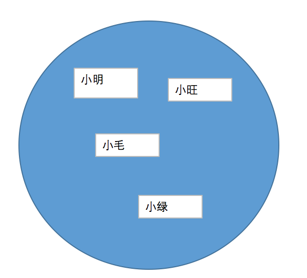

# Redis

Redis 是一种内存数据库，是实现网站优化、高并发的必备技能。

Redis 的特点是：

1. 数据保存在内存，性能极高
2. 支持五种数据类型：字符串、列表、集合、有序集合、Hash
3. 可以自动备份数据到硬盘，以防止内存数据丢失
4. 内置主从、集群等功能，让我们轻松搭建 Redis 集群


情况一、：在 Linux 下安装 Redis

情况二、：平时开发


使用 Redis 需要先安装 Redis 软件，我们可以使用 `VisualNMP` 中自带的 `Redis` 软件。


当我们开启了 Nginx 和 Redis 软件之后，我们就可以使用 `phpRedisAdmin` 这个图形界面来管理 Redis 数据：


## 五种数据类型

我们在保存数据时需要选择一种合适的类型，为了能够选择合适的类型，我们需要对五种数据类型有比较深入了了解：

指令手册：http://doc.redisfans.com/

### string（字符串）

字符串由 键 和 值两部分组成，比如： name= tom  ， age =10。适合用来`缓存网站中的热数据，如日志排行榜 `，注意，如果要缓存数组、对象等复杂类型的数据，需要先转成 JSON（序列化）字符串，然后保存。

说明：一个字符串的值最长可以是 512 M。


### list （列表）

列表：有`先后顺序`的`多个值`。

列表中可以保存多个值，这些值按先后顺序排成一排，适合开发像`抢票`、`秒杀`这种需要排队的场景。


### set （集合）

集合：`不重复`的`无序`的`多个值`。

集合上还可以进行求 交集、并集、差集的操作，比如适合开发好友系统。




### zset （有序集合）

有序集合：根据`分值排序`的`不重复`的`多个值`。

我们可以为集合中的每个值设置一个分值，然后根据这个分值对数据进行排序。


### hash（哈希）

哈希：可以保存`多个值`，每个值又是由` 键 和 值 `组成的。

哈希类似 PHP 中的`关联数组`，即有一组数组成，每个数由键值对组成。


## 用途

Redis 在网站开发中最常见的用途：

1. 缓存网站热数据
2. 保存 SESSION
3. 简单消息队列
4. 解决异地同步数据时的延迟
5. 多进程时数据同步


### 扩展

除了 Redis 之外还有一个非常常用的内存缓存软件： MemCache。

MemCache 的功能比较单一，只能保存字符串（只能1M）。相对的，越简单，性能就越好。所以在需要缓存结构单一的数据时也可以使用它。


# predis 扩展

要使用 PHP 操作 Redis 需要安装扩展才可以，有两种扩展可以使用：

1. 使用 C 语言编写的 redis 扩展
2. 使用 PHP 语言编写的 redis 类库

我们这里使用第2种 PHP 语言的 predis 扩展。


使用 composer 安装扩展：

```
composer require predis/predis
```


## 使用 predis

要使用 composer 下载的类库，我们需要先引入自动加载文件：

```php
require(ROOT.'vendor/autoload.php');
```

然后就可以在项目中使用了。

1、连接 Redis 服务器

```php
$client = new \Predis\Client([
    'scheme' => 'tcp',
    'host'   => '10.0.0.1',
    'port'   => 6379,
]);
```


2、数据操作

```php
//普通set/get操作
$redis->set('library', 'predis');
$retval = $redis->get('library');
echo $retval; //显示 'predis'
 
//setex set一个存储时效
$redis->setex('str', 10, 'bar'); //表示存储有效期为10秒
 
//setnx/msetnx相当于add操作,不会覆盖已有值
$redis->setnx('foo',12); //true
$redis->setnx('foo',34); //false
 
//getset操作,set的变种,结果返回替换前的值
$redis->getset('foo',56);//返回34
 
// incrby/incr/decrby/decr 对值的递增和递减
$redis->incr('foo'); //foo为57
$redis->incrby('foo',2); //foo为59
 
//exists检测是否存在某值
$redis->exists('foo');//true
 
//del 删除
$redis->del('foo');//true
 
//type 类型检测,字符串返回string,列表返回 list,set表返回set/zset,hash表返回hash
$redis->type('foo');//不存在,返回none
$redis->set('str','test');
$redis->type('str'); //字符串，返回string
 
//append 连接到已存在字符串
$redis->append('str','_123'); //返回累加后的字符串长度8,此进str为 'test_123'
 
//setrange 部分替换操作
$redis->setrange('str',0,'abc'); //返回3,参数2为0时等同于set操作
$redis->setrange('str',2,'cd');//返回4,表示从第2个字符后替换,这时'str'为'abcd'
 
//substr 部分获取操作
$redis->substr('str',0,2);//表示从第0个起，取到第2个字符，共3个，返回'abc'
 
//strlen 获取字符串长度
$redis->strlen('str'); //返回4
 
//setbit/getbit 位存储和获取
$redis->setbit('binary',31,1);  //表示在第31位存入1,这边可能会有大小端问题?不过没关系,getbit 应该不会有问题
$redis->getbit('binary',31);    //返回1
 
//keys 模糊查找功能,支持*号以及?号(匹配一个字符)
$redis->set('foo1',123);
$redis->set('foo2',456);
$redis->keys('foo*'); //返回foo1和foo2的array
$redis->keys('f?o?');  //同上
 
//randomkey 随机返回一个key
$redis->randomkey(); //可能是返回 'foo1'或者是'foo2'及其它任何一存在redis的key
 
//rename/renamenx 对key进行改名,所不同的是renamenx不允许改成已存在的key
$redis->rename('str','str2'); //把原先命名为'str'的key改成了'str2'
 
//expire 设置key-value的时效性,ttl 获取剩余有效期,persist 重新设置为永久存储
$redis->expire('foo', 1); //设置有效期为1秒
$redis->ttl('foo'); //返回有效期值1s
$redis->expire('foo'); //取消expire行为
 
//dbsize 返回redis当前数据库的记录总数
$redis->dbsize();
 
/*
队列操作
*/
 
//rpush/rpushx 有序列表操作,从队列后插入元素
//lpush/lpushx 和rpush/rpushx的区别是插入到队列的头部,同上,'x'含义是只对已存在的key进行操作
$redis->rpush('fooList', 'bar1'); //返回一个列表的长度1
$redis->lpush('fooList', 'bar0'); //返回一个列表的长度2
$redis->rpushx('fooList', 'bar2'); //返回3,rpushx只对已存在的队列做添加,否则返回0
//llen返回当前列表长度
$redis->llen('fooList');//3
 
//lrange 返回队列中一个区间的元素
$redis->lrange('fooList',0,1); //返回数组包含第0个至第1个共2个元素
$redis->lrange('fooList',0,-1);//返回第0个至倒数第一个,相当于返回所有元素,注意redis中很多时候会用到负数,下同
 
//lindex 返回指定顺序位置的list元素
$redis->lindex('fooList',1); //返回'bar1'
 
//lset 修改队列中指定位置的value
$redis->lset('fooList',1,'123');//修改位置1的元素,返回true
 
//lrem 删除队列中左起指定数量的字符
$redis->lrem('fooList',1,'_'); //删除队列中左起(右起使用-1)1个字符'_'(若有)
 
//lpop/rpop 类似栈结构地弹出(并删除)最左或最右的一个元素
$redis->lpop('fooList'); //'bar0'
$redis->rpop('fooList'); //'bar2'
 
//ltrim 队列修改，保留左边起若干元素，其余删除
$redis->ltrim('fooList', 0,1); //保留左边起第0个至第1个元素
 
//rpoplpush 从一个队列中pop出元素并push到另一个队列
$redis->rpush('list1','ab0');
$redis->rpush('list1','ab1');
$redis->rpush('list2','ab2');
$redis->rpush('list2','ab3');
$redis->rpoplpush('list1','list2');//结果list1 =>array('ab0'),list2 =>array('ab1','ab2','ab3')
$redis->rpoplpush('list2','list2');//也适用于同一个队列,把最后一个元素移到头部list2 =>array('ab3','ab1','ab2')
 
//linsert 在队列的中间指定元素前或后插入元素
$redis->linsert('list2', 'before','ab1','123'); //表示在元素'ab1'之前插入'123'
$redis->linsert('list2', 'after','ab1','456');   //表示在元素'ab1'之后插入'456'
 
//blpop/brpop 阻塞并等待一个列队不为空时，再pop出最左或最右的一个元素（这个功能在php以外可以说非常好用）
//brpoplpush 同样是阻塞并等待操作，结果同rpoplpush一样
$redis->blpop('list3',10); //如果list3为空则一直等待,直到不为空时将第一元素弹出,10秒后超时
 
/**
set表操作
*/
 
//sadd 增加元素,返回true,重复返回false
$redis->sadd('set1','ab');
$redis->sadd('set1','cd');
$redis->sadd('set1','ef');
 
//srem 移除指定元素
$redis->srem('set1','cd'); //删除'cd'元素
 
//spop 弹出首元素
$redis->spop('set1');
 
//smove 移动当前set表的指定元素到另一个set表
$redis->sadd('set2','123');
$redis->smove('set1','set2','ab');//移动'set1'中的'ab'到'set2',返回true or false
 
//scard 返回当前set表元素个数
$redis->scard('set2');//2
 
//sismember 判断元素是否属于当前表
$redis->sismember('set2','123'); //true or false
 
//smembers 返回当前表的所有元素
$redis->smembers('set2'); //array('123','ab');
 
//sinter/sunion/sdiff  返回两个表中元素的交集/并集/补集
$redis->sadd('set1','ab');
$redis->sinter('set2','set1'); //返回array('ab')
 
//sinterstore/sunionstore/sdiffstore 将两个表交集/并集/补集元素copy到第三个表中
$redis->set('foo',0);
$redis->sinterstore('foo','set1'); //这边等同于将'set1'的内容copy到'foo'中，并将'foo'转为set表
$redis->sinterstore('foo',array('set1','set2')); //将'set1'和'set2'中相同的元素copy到'foo'表中,覆盖'foo'原有内容
 
//srandmember 返回表中一个随机元素
$redis->srandmember('set1');
 
/**
有序set表操作
*/
 
//sadd 增加元素,并设置序号,返回true,重复返回false
$redis->zadd('zset1',1,'ab');
$redis->zadd('zset1',2,'cd');
$redis->zadd('zset1',3,'ef');
 
//zincrby 对指定元素索引值的增减,改变元素排列次序
$redis->zincrby('zset1',10,'ab');//返回11
 
//zrem 移除指定元素
$redis->zrem('zset1','ef'); //true or false
 
//zrange 按位置次序返回表中指定区间的元素
$redis->zrange('zset1',0,1); //返回位置0和1之间(两个)的元素
$redis->zrange('zset1',0,-1);//返回位置0和倒数第一个元素之间的元素(相当于所有元素)
 
//zrevrange 同上,返回表中指定区间的元素,按次序倒排
$redis->zrevrange('zset1',0,-1); //元素顺序和zrange相反
 
//zrangebyscore/zrevrangebyscore 按顺序/降序返回表中指定索引区间的元素
$redis->zadd('zset1',3,'ef');
$redis->zadd('zset1',5,'gh');
$redis->zrangebyscore('zset1',2,9); //返回索引值2-9之间的元素 array('ef','gh')
//参数形式
$redis->zrangebyscore('zset1',2,9,'withscores'); //返回索引值2-9之间的元素并包含索引值 array(array('ef',3),array('gh',5))
$redis->zrangebyscore('zset1',2,9,array('withscores' =>true,'limit'=>array(1, 2))); //返回索引值2-9之间的元素,'withscores' =>true表示包含索引值; 'limit'=>array(1, 2),表示最多返回2条,结果为array(array('ef',3),array('gh',5))
 
//zunionstore/zinterstore 将多个表的并集/交集存入另一个表中
$redis->zunionstore('zset3',array('zset1','zset2','zset0')); //将'zset1','zset2','zset0'的并集存入'zset3'
//其它参数
$redis->zunionstore('zset3',array('zset1','zset2'),array('weights' => array(5,0)));//weights参数表示权重，其中表示并集后值大于5的元素排在前，大于0的排在后
$redis->zunionstore('zset3',array('zset1','zset2'),array('aggregate' => 'max'));//'aggregate' => 'max'或'min'表示并集后相同的元素是取大值或是取小值
 
//zcount 统计一个索引区间的元素个数
$redis->zcount('zset1',3,5);//2
$redis->zcount('zset1','(3',5)); //'(3'表示索引值在3-5之间但不含3,同理也可以使用'(5'表示上限为5但不含5
 
//zcard 统计元素个数
$redis->zcard('zset1');//4
 
//zscore 查询元素的索引
$redis->zscore('zset1','ef');//3
 
//zremrangebyscore 删除一个索引区间的元素
$redis->zremrangebyscore('zset1',0,2); //删除索引在0-2之间的元素('ab','cd'),返回删除元素个数2
 
//zrank/zrevrank 返回元素所在表顺序/降序的位置(不是索引)
$redis->zrank('zset1','ef');//返回0,因为它是第一个元素;zrevrank则返回1(最后一个)
 
//zremrangebyrank 删除表中指定位置区间的元素
$redis->zremrangebyrank('zset1',0,10); //删除位置为0-10的元素,返回删除的元素个数2 
 
/**
hash表操作
*/
 
//hset/hget 存取hash表的数据
$redis->hset('hash1','key1','v1'); //将key为'key1' value为'v1'的元素存入hash1表
$redis->hset('hash1','key2','v2');
$redis->hget('hash1','key1');  //取出表'hash1'中的key 'key1'的值,返回'v1'
 
//hexists 返回hash表中的指定key是否存在
$redis->hexists ('hash1','key1'); //true or false
 
//hdel 删除hash表中指定key的元素
$redis->hdel('hash1','key2'); //true or false
 
//hlen 返回hash表元素个数
$redis->hlen('hash1'); //1
 
//hsetnx 增加一个元素,但不能重复
$redis->hsetnx('hash1','key1','v2'); //false
$redis->hsetnx('hash1','key2','v2'); //true
 
//hmset/hmget 存取多个元素到hash表
$redis->hmset('hash1',array('key3'=>'v3','key4'=>'v4'));
$redis->hmget('hash1',array('key3','key4')); //返回相应的值 array('v3','v4')
 
//hincrby 对指定key进行累加
$redis->hincrby('hash1','key5',3); //返回3
$redis->hincrby('hash1','key5',10); //返回13
 
//hkeys 返回hash表中的所有key
$redis->hkeys('hash1'); //返回array('key1','key2','key3','key4','key5')
 
//hvals 返回hash表中的所有value
$redis->hvals('hash1'); //返回array('v1','v2','v3','v4',13)
 
//hgetall 返回整个hash表元素
$redis->hgetall('hash1'); //返回array('key1'=>'v1','key2'=>'v2','key3'=>'v3','key4'=>'v4','key5'=>13)
```

 

## 忽略 vendor

使用 composer 下载的文件太多，而且还会生成一个临时文件（composer.lock），这些文件太大的话会影响上传、下载到服务器的速度，所以我们一般忽略这些文件（这些文件不会上传到 github上）：

.gitignore

~~~
/public/contents/
/public/index.html
/vendor/
/composer.lock
~~~

忽略掉之后在 github上只有我们项目中核心的代码。


## 安装项目

其他的开发人员，要想一起开发，需要先使用 `git clone` 下载我们的项目，因为 github 上没有 vendor 等包文件，所以下载完核心代码之后，需要再执行 `composer install` 单独再安装第三方的包文件，然后才能运行项目。


# 保存 SESSION

SESSION 中的数据默认是保存在文件中的，如果网站的访问量比较大，就会导致服务器要同时打开大量的 SESSION 文件 ，这会导致硬盘 IO 过于繁忙，最终导致硬盘阻塞，拖慢整个服务器的性能。

所以最好的方式是把 SESSION 保存到内存中。我们可以使用 `ini_set` 函数设置 SESSION 保存的位置：

```
// 动态的修改 php.ini 配置文件
ini_set('session.save_handler', 'redis');   // 使用 redis 保存 SESSION
ini_set('session.save_path', 'tcp://127.0.0.1:6379?database=3');  // 设置 redis 服务器的地址、端口、使用的数据库
```


# 缓存浏览量

当用户浏览了一遍日志时，浏览量就应该加1。这个功能本身很简单，但是如果要实现性能优化，那么就得多考虑一下了：每次浏览日志都要连接数据库并更新数据，对数据库的操作太过频繁，我们应该思考一下这个功能如何优化呢？

网站优点的一个核心思路是：尽量少操作数据库，尤其是频繁访问的数据，对于频繁使用的数据我们可以使用 `Redis` 把数据缓存在内存中。


功能实现思路：

1. 在 Redis 中缓存所有日志的浏览量
2. 用户浏览网站时，我直接修改内存中的浏览量（从redis读取和更新浏览量）
3. 定期回写到数据库
4. 注意：因为是静态页，不能执行PHP，我们需要使用 JS 的代码在浏览器中运行，使用 AJAX 技术提交到服务器


在这个架构中，每篇日志只有在第一次访问时才会读取数据库，之后的操作都是操作内存。


作业：

1. 在项目中添加一个方法，实现把Redis中的数据更新到数据库中..
2. 在视图中编写 JS 代码使用 AJAX 更新浏览量